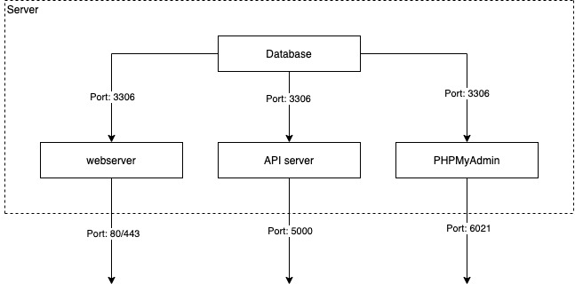

# LAMP (Linux-Apache-MySQL-PHP) Docker Compose

## Introduction

This repository can be used to host LAMP (Linux, Apache, Mariadb, PHP) server using docker compose. The docker images used for building LAMP stack are:-

1. Web server - php:7.4-apache
2. API server - python:3.8.2
3. Database - mariadb:10.5.1-bionic
4. PHPMyAdmin - phpmyadmin/phpmyadmin

## Instructions

1. The default configuration is saved as `sample_env`. Copy contents from `sample_env` to `.env`.

   ```csh
   cp sample_env .env
   ```

2. Make necessary changes to `.env` file.
3. Build docker-compose image using the following command.

   ```csh
   docker-compose build --no-cache
   ```

4. Run docker-compose using the following command.

   ```csh
   docker-compose up -d
   ```

5. To shut down docker-compose container, using the following command.

   ```csh
   docker-compose down
   ```

## Architecture



## Folder Structure

1. API source code - bin/apiserver/code
2. Webserver source code - bin/webserver/code

## Contributors

1. Sashwat K sashwat0001@gmail.com
